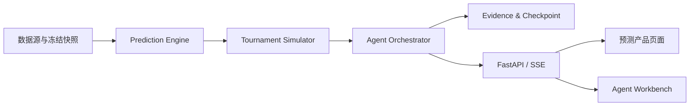

# World Cup Prediction Agent

一个面向 AI Agent 应用开发与求职展示的世界杯冠军预测项目：用可复现的概率模型推演完整赛程，再由 Agent 组织工具调用、证据校验与可解释结果输出。

> [!IMPORTANT]
> 当前仓库是**完整产品设计与 Coding Agent 实施交接包**，不是已经可以运行的应用。源码、数据产物、测试、容器和验收报告仍需按计划实现。

## 项目目标

- 获取历史战绩、球队排名、球员与分组赛程等数据，并冻结可追溯的数据快照；
- 结合 Elo、进球分布模型、概率校准和 Monte Carlo 模拟，预测逐场比分与晋级概率；
- 完整推演 48 队世界杯的小组赛、最佳第三名、淘汰赛和最终冠军；
- 通过 Agent Workbench 展示计划、工具调用、证据、状态变化、失败恢复与人工审批；
- 通过冠军页、赛程树、比分热力图和回测页面呈现预测依据，而不是只给一个答案。

## 当前完整度

| 模块 | 状态 | 说明 |
| --- | --- | --- |
| 产品范围与架构 | 已完成 | 目标、边界、数据合同、API、UI 与验收标准已定义 |
| Coding Agent 交接 | 已完成 | 7 份实施计划，合计 61 个 Task、366 个待执行步骤 |
| 后端、预测引擎与赛事模拟 | 待实现 | 当前没有 Python 源码、模型 artifact 或真实预测结果 |
| 前端与 Agent Workbench | 待实现 | 当前没有 React 应用或可运行页面 |
| 测试、Docker、CI 与验收报告 | 待实现 | 必须由 Coding Agent 实际运行后生成，不能以计划中的预期结果代替 |

## 目标架构

核心原则：数值模型负责概率、比分和排名计算；LLM 负责规划、工具编排与基于证据的解释，不直接编造预测数值，也不展示原始 Chain of Thought。

## 交给 ZCode 实施

从 [`docs/ZCODE_HANDOFF.md`](docs/ZCODE_HANDOFF.md) 开始。Coding Agent 应先阅读完整产品设计，再严格按七份计划的既定顺序逐 Task 执行 TDD、验证和提交；只有当前计划的 Completion Gate 通过后，才能进入下一阶段。

推荐启动指令已写在交接指南中。最终完成依据不是生成了多少文件，而是系统集成计划产出的 `ACCEPTANCE_REPORT` 和对应的实际测试证据。

## 文档导航

### 产品规范与交接

- [`ZCODE_HANDOFF.md`](docs/ZCODE_HANDOFF.md)：执行入口、实施顺序、权限边界和停止条件
- [`完整产品交接设计`](docs/superpowers/specs/2026-07-16-complete-product-handoff-design.md)：产品单一事实源
- [`TECHNICAL_REPORT_MAPPING.md`](docs/TECHNICAL_REPORT_MAPPING.md)：原技术报告内容的保留、修订与替代关系
- [`Agent Workbench 设计`](docs/superpowers/specs/2026-07-15-agent-workbench-design.md)：Agent 展示层与交互设计

### 七份实施计划

1. [`Agent Runtime Foundation`](docs/superpowers/plans/2026-07-15-agent-runtime-foundation.md)
2. [`Agent Workbench UI`](docs/superpowers/plans/2026-07-15-agent-workbench-ui.md)
3. [`Prediction Engine`](docs/superpowers/plans/2026-07-16-prediction-engine.md)
4. [`FIFA 2026 Tournament Simulator`](docs/superpowers/plans/2026-07-16-tournament-simulator.md)
5. [`Real LLM Agent Integration`](docs/superpowers/plans/2026-07-16-llm-agent-integration.md)
6. [`Prediction Product UI`](docs/superpowers/plans/2026-07-16-prediction-product-ui.md)
7. [`System Integration and Acceptance`](docs/superpowers/plans/2026-07-16-system-integration-acceptance.md)

## 验收底线

- 任何特征、排名和模型输入都不能读取预测截止时间之后的数据；
- Demo fixture 不能冒充真实模型评估或最终产品预测；
- 每个预测都要能够追溯数据版本、模型版本、赛制规则和证据；
- Replay 不得产生外部调用，失败恢复与人工审批必须可以现场演示；
- 文档中的命令和预期输出只有在实际执行通过后，才能记为验收结果。
