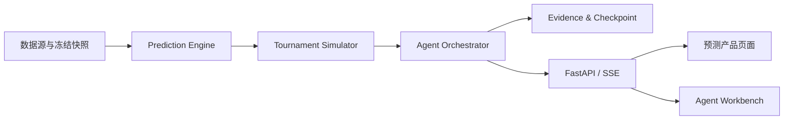

# World Cup Prediction Agent

一个面向 AI Agent 应用开发与求职展示的世界杯冠军预测项目：用可复现的概率模型推演完整 48 队赛程，再由 Agent 组织工具调用、证据校验与可解释结果输出。

> 冠军预测是概率分布，不是确定性结论。所有 Elo、比分、概率、排名和回测指标由确定性 Python 生成；LLM 只负责解析、路由与解释。

## 快速开始（Portfolio 离线模式，无需网络或密钥）

```powershell
# 后端
cd backend
python -m pip install -e ".[dev]"
uvicorn worldcup_agent.api.app:app --reload --port 8000

# 前端（另开终端）
cd frontend
npm install
npm run dev
# 打开 http://localhost:5173
```

或一条命令启动容器化演示：

```powershell
docker compose up -d --build
# 打开 http://127.0.0.1:4173
```

## 功能

- **预测引擎**：加权 Elo、独立 Poisson / Bivariate Poisson / Dixon-Coles、Logistic 校准、融合、IPF 比分矩阵归一、可复现 2022 回测。
- **赛事模拟**：48 队、12 组、72 场小组赛 + 32 场淘汰赛 = 104 场；495 行 Annexe C 最佳第三名映射；递归 head-to-head tie-break；蒙特卡洛与收敛记录。
- **Agent 运行时**：单 Orchestrator + Tool Registry + Evidence Store + Critic；检查点恢复、人工审批、Replay、故障注入；LangGraph 编排；FastAPI/SSE。
- **LLM 集成**：OpenAI-compatible provider adapter；无 key 时确定性 fallback；证据约束发布；不展示思考链。
- **产品 UI**：冠军总览、赛事树、单场比分热力图、球队阶段概率、2022 回测、Agent Workbench；移动端适配与可访问图表。

## 测试与重建

```powershell
# 后端测试 + 静态检查
cd backend
python -m pytest -q
python -m ruff check src tests

# 前端测试 + 构建 + E2E
cd frontend
npm test
npm run build
npm run e2e

# 从公开数据重建 baseline artifacts
worldcup-rebuild --source ../international_results-master/results.csv `
  --output ../artifacts/generated `
  --forecast-cutoff 2026-06-10T23:59:59Z `
  --train-end 2022-11-19 --backtest-end 2022-12-18 `
  --seed 20260611 --profile baseline
```

## 当前完整度

| 模块 | 状态 | 说明 |
| --- | --- | --- |
| 后端 Agent Runtime | 已完成 | LangGraph 编排、工具注册表、SQLite 持久化、检查点恢复、人工审批、FastAPI/SSE |
| 预测引擎与赛事模拟 | 已完成 | Elo、三种进球模型、IPF 校准、2022 回测、495 Annexe C、104 场模拟、蒙特卡洛 |
| 前端 Agent Workbench | 已完成 | React + xyflow Run Graph、Step Inspector、Replay、故障注入、移动端适配 |
| 前端预测产品 UI | 已完成 | Overview、赛程树、单场/球队详情、2022 回测、Agent Workbench 联动 |
| LLM Agent 集成 | 已完成 | OpenAI-compatible adapter、确定性 fallback、证据约束发布 |
| 离线 Portfolio 包 | 已完成 | artifacts/demo 含 forecast、completed-run、evidence、backtest |
| 容器化与 CI | 已完成 | Docker Compose、GitHub Actions、安全 redaction、验收报告 |
| 测试、Docker、CI 与验收报告 | 待实现 | 必须由 Coding Agent 实际运行后生成，不能以计划中的预期结果代替 |

## 目标架构



核心原则：数值模型负责概率、比分和排名计算；LLM 负责规划、工具编排与基于证据的解释，不直接编造预测数值，也不展示原始 Chain of Thought。

## 交给 ZCode 实施

从 [`docs/ZCODE_HANDOFF.md`](docs/ZCODE_HANDOFF.md) 开始。Coding Agent 应先阅读完整产品设计，再严格按七份计划的既定顺序逐 Task 执行 TDD、验证和提交；只有当前计划的 Completion Gate 通过后，才能进入下一阶段。

推荐启动指令已写在交接指南中。最终完成依据不是生成了多少文件，而是系统集成计划产出的 `ACCEPTANCE_REPORT` 和对应的实际测试证据。

### 本地启动 Agent Runtime（已实现）

```powershell
cd backend
python -m pip install -e ".[dev]"
uvicorn worldcup_agent.api.app:app --reload --port 8000
```

## 文档导航

### 产品规范与交接

- [`ZCODE_HANDOFF.md`](docs/ZCODE_HANDOFF.md)：执行入口、实施顺序、权限边界和停止条件
- [`完整产品交接设计`](docs/superpowers/specs/2026-07-16-complete-product-handoff-design.md)：产品单一事实源
- [`TECHNICAL_REPORT_MAPPING.md`](docs/TECHNICAL_REPORT_MAPPING.md)：原技术报告内容的保留、修订与替代关系
- [`原技术报告（历史归档）`](docs/archive/TECHNICAL_REPORT_ORIGINAL.md)：保留早期完整方案与设计演进，不作为当前实施依据
- [`历史技术报告归档说明`](docs/archive/README.md)：归档定位和文档优先级
- [`Agent Workbench 设计`](docs/superpowers/specs/2026-07-15-agent-workbench-design.md)：Agent 展示层与交互设计

### 七份实施计划

1. [`Agent Runtime Foundation`](docs/superpowers/plans/2026-07-15-agent-runtime-foundation.md)
2. [`Agent Workbench UI`](docs/superpowers/plans/2026-07-15-agent-workbench-ui.md)
3. [`Prediction Engine`](docs/superpowers/plans/2026-07-16-prediction-engine.md)
4. [`FIFA 2026 Tournament Simulator`](docs/superpowers/plans/2026-07-16-tournament-simulator.md)
5. [`Real LLM Agent Integration`](docs/superpowers/plans/2026-07-16-llm-agent-integration.md)
6. [`Prediction Product UI`](docs/superpowers/plans/2026-07-16-prediction-product-ui.md)
7. [`System Integration and Acceptance`](docs/superpowers/plans/2026-07-16-system-integration-acceptance.md)

## 验收底线

- 任何特征、排名和模型输入都不能读取预测截止时间之后的数据；
- Demo fixture 不能冒充真实模型评估或最终产品预测；
- 每个预测都要能够追溯数据版本、模型版本、赛制规则和证据；
- Replay 不得产生外部调用，失败恢复与人工审批必须可以现场演示；
- 文档中的命令和预期输出只有在实际执行通过后，才能记为验收结果。
